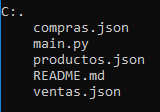

# PanCamp
Este es un sistema de gestion una panaderia en la cual se usan archivos *.json* para llevar un registro de las ventas realizadas, las compras a proveedores y uno para los productos disponibles.

En este programa podras acceder a un menu en el cual puedes realizar una venta, registrar una comprar a un proveedor y ver informes de ventas y compras realizadas
## Estructura





## Tecnologias usadas


## Funciones
|Archivo|Funcion|
|--|--|
|**compras.json**|Archivo para almacenar el historial de compra a los proveedores|
|**main.py**|Archivo para ejecutar el programa|
|**productos.json**|Archivo en el cual se encuentran los productos disponibles con su nombre y precio|
|ventas.json|Archivo en el cual se guarda el registro de las ventas realizadas|

## Instalación y Uso
**Debes tener instalado visual studio code, python y git en su ultima version**
- Para ello debes clonar el directorio del siguiente link de git hub https://github.com/Luis-Orlando-Henao-Bermon/Trabajo_Python_HenaoLuis

- Abre la terminal de git bash y allí escribe el siguiente comando:     

``` bash 
git clone https://github.com/Luis-Orlando-Henao-Bermon/Trabajo_Python_HenaoLuis
```
- Abre visual studio code e instalas la extencion de python


- Abres una nueva terminal de git dando siguiendo las siguientes instrucciones:


- Y finalmente ejecutas el siguiente comando en git bash
```bash
python main.py
```

## Créditos

Desarrollado por: *Luis Orlando Henao Bermon*